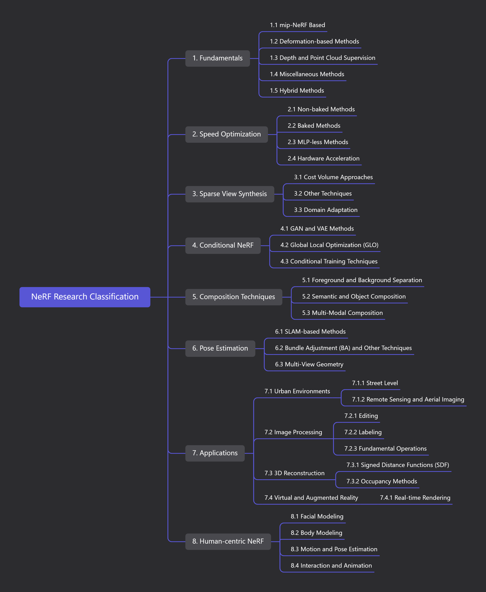

# NeRF Research Classification Repository

Welcome to the NeRF Research Classification Repository! This repository is dedicated to categorizing and summarizing the burgeoning literature in the field of Neural Radiance Fields (NeRF). The aim is to create a structured and easily navigable roadmap to help researchers, students, and enthusiasts delve into NeRF-related studies with ease.

## Repository Structure

- **Fundamentals:** Delve into the core principles underlying NeRF including mip-NeRF based methods, deformation-based techniques, and depth/point cloud supervision.
  
- **Speed Optimization:** Explore various methods aimed at enhancing the speed of NeRF algorithms, including non-baked, baked, and MLP-less methods.

- **Sparse View Synthesis:** Discover techniques for sparse view synthesis in NeRF using cost volume approaches among others.

- **Conditional NeRF:** Uncover conditional NeRF techniques employing GAN/VAE methods and Global Local Optimization.

- **Composition Techniques:** Learn about foreground/background separation and semantic/object composition in NeRF.

- **Pose Estimation:** Delve into pose estimation techniques within NeRF, including SLAM-based methods and Bundle Adjustment.

- **Applications:** Explore the diverse applications of NeRF in urban environments, image processing, and 3D reconstruction.

- **Human-centric NeRF:** Explore human-centric applications of NeRF including facial and body modeling, as well as motion and pose estimation.

Each category in this repository provides a curated list of papers, along with brief descriptions to give an insight into the research focus and contributions. We welcome contributions and suggestions to keep this repository updated with the latest advancements in the NeRF domain.

## 1. Fundamentals (Basic Principles)

   - 1.1 mip-NeRF Based (Based on mip-NeRF)
     - Introduction and exploration of NeRF methods based on Multi-Level Pyramid (mip), and how to improve NeRF performance and effects by using this technique.
   - 1.2 Deformation-based Methods (Based on Deformation)
     - Research and analysis of deformation techniques in NeRF, including how to utilize deformation to improve 3D reconstruction and view synthesis.
   - 1.3 Depth and Point Cloud Supervision
     - Discuss how to supervise and optimize NeRF training process through depth information and point cloud data.
   - 1.4 Miscellaneous Methods
     - Includes other research methods and techniques related to NeRF basic principles that do not belong to the above categories.
   - 1.5 Hybrid Methods
     - Discuss methods of improving NeRF performance by combining multiple techniques (such as deformation-based methods and depth supervision).

## 2. Speed Optimization

   - 2.1 Non-baked Methods
     - Research and analysis of non-precomputed or real-time NeRF technologies, and how to optimize speed without using precomputation.
   - 2.2 Baked Methods
     - Discuss methods and techniques to accelerate NeRF through precomputed data.
   - 2.3 MLP-less Methods
     - Discuss methods to optimize NeRF speed without using Multi-Layer Perceptrons (MLP).
   - 2.4 Hardware Acceleration
     - Analysis of methods and techniques to accelerate NeRF computation using hardware resources such as GPU, TPU, etc.

## 3. Sparse View Synthesis

   - 3.1 Cost Volume Approaches
     - Methods to solve sparse view synthesis problems in NeRF through cost volume.
   - 3.2 Other Techniques
     - Introduction to other techniques and methods for sparse view synthesis.
   - 3.3 Domain Adaptation
     - Discuss how to improve NeRF performance in sparse view synthesis through domain adaptation techniques.

## 4. Conditional NeRF

   - 4.1 GAN and VAE Methods
     - Methods to implement conditional NeRF using Generative Adversarial Networks (GAN) and Variational Autoencoders (VAE).
   - 4.2 Global Local Optimization (GLO)
     - Discuss techniques to improve NeRF performance through Global Local Optimization.
   - 4.3 Conditional Training Techniques
     - Discuss how to optimize the learning process of NeRF models using conditional training techniques.

## 5. Composition Techniques

   - 5.1 Foreground and Background Separation
     - Research and analysis on how to achieve foreground and background separation and composition in NeRF.
   - 5.2 Semantic and Object Composition
     - Discuss how to improve NeRF performance through semantic and object-level composition.
   - 5.3 Multi-Modal Composition
     - Discuss how to improve NeRF composition techniques using multi-modal data (such as images and semantic information).

## 6. Pose Estimation

   - 6.1 SLAM-based Methods
     - Introduction to NeRF methods for pose estimation using SLAM technology.
   - 6.2 Bundle Adjustment (BA) and Other Techniques
     - Discuss optimizing pose estimation in NeRF through bundle adjustment and other techniques.
   - 6.3 Multi-View Geometry
     - Research on how multi-view geometry techniques are applied to pose estimation in NeRF.

## 7. Applications

   - 7.1 Urban Environments
     - 7.1.1 Street Level
       - Discuss NeRF applications at the street level, such as 3D reconstruction and view synthesis.
     - 7.1.2 Remote Sensing and Aerial Imaging
       - Research and analysis of NeRF applications in the field of remote sensing and aerial imaging.
   - 7.2 Image Processing
     - 7.2.1 Editing
       - Discuss methods and techniques for image editing using NeRF.
     - 7.2.2 Labeling
       - Introduction to techniques for labeling images and 3D data using NeRF.
     - 7.2.3 Fundamental Operations
       - Discuss basic operations in image processing using NeRF, such as filtering and enhancement.
   - 7.3 3D Reconstruction
     - 7.3.1 Signed Distance Functions (SDF)
       - Introduction to NeRF methods for 3D reconstruction using Signed Distance Functions.
     - 7.3.2 Occupancy Methods
       - Discuss NeRF techniques for 3D reconstruction using occupancy information.
   - 7.4 Virtual and Augmented Reality
     - 7.4.1 Real-time Rendering
       - Discuss NeRF applications in real-time rendering, including performance in VR/AR environments.

## 8. Human-centric NeRF

   - 8.1 Facial Modeling
     - Research and analysis of NeRF applications in facial modeling.
   - 8.2 Body Modeling
     - Discuss techniques and methods for body modeling using NeRF.
   - 8.3 Motion and Pose Estimation
     - Introduction to methods for motion and pose estimation using NeRF.
   - 8.4 Interaction and Animation
     - Research and analysis of methods and techniques for creating interactive and dynamic 3D models using NeRF.

## Contributing

We encourage contributions from the community. Whether you want to add new papers, categories, or improve the existing classification, feel free to make a pull request.

## Contact
For any inquiries or suggestions, please open an issue .

